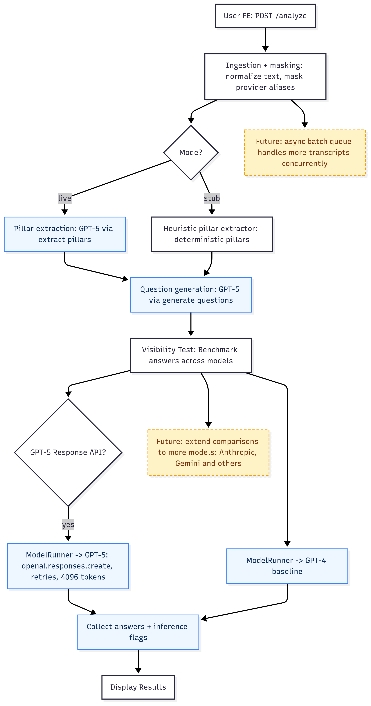

# Story AI Visibility Agents

Generate brand-visibility briefs by masking provider names and comparing how multiple LLMs (GPT-5 primary, GPT-4o comparison) respond. The pipeline ingests a transcript, extracts selling points, asks domain-expert questions, and highlights where models still infer the masked provider.

## Judges, here’s the TL;DR

- Live deployment: `https://story-ai-visibility-fe.vercel.app`
- **Codex in Development**: `AGENTS.md` defines agent roles, while `docs/PRD.md` and `docs/PRD_v2.md` specify the delivery roadmap; the Codex CLI tool enforces those specs by running pytest, linting prompts, and shipping atomic patches so every change is reviewable.
- **GPT-5 in Project**: `src/cli.py` drives GPT-5 through `assets/visibility/system.prompt.md`, `assets/visibility/extract_pillars.prompt.md`, and `assets/visibility/generate_questions.prompt.md` to mask providers, generate probes, and score inference; GPT-4o cross-checks outputs, and stub fixtures keep evaluations reproducible.
- **Live Demo**: TBD — planned demo highlights side-by-side GPT-5 vs GPT-4o inference detection, latency, and masking compliance once validation logging is finalized.
- **Technicality**: 1) Algorithm — deterministic ingestion → provider masking → pillar extraction → question generation → inference scoring with confidence flags; 2) Tech stack — Python 3.11+, FastAPI, modular `src/common` utilities, pytest coverage targets ≥85%, Codex-driven scripts under `scripts/`.
- **Frontend Notes**: React client (`https://github.com/JessieJessJe/story-ai-visibility-fe`) hits the FastAPI backend and surfaces inference scores; production build runs at `https://story-ai-visibility-fe.vercel.app`.

Summary created by Codex.

## Architecture Flow



## Business Context


## Requirements

- Python 3.11+
- OpenAI API access (for live runs)
- `python3 -m pip install -r requirements.txt`

## Quick Start

```bash
python3 -m pip install -r requirements.txt
cp .env.example .env  # add your OpenAI key for live mode later
python3 -m pytest     # run stubbed tests
```

### Project Layout

- `src/` – CLI, GPT service wrapper, evaluator, storage helpers
- `assets/visibility/` – Prompt templates (system, extract pillars, generate questions)
- `docs/` – PRD, schema, samples
- `tests/` – Pytest-style unit tests + fixtures
- `artifacts/` – Live/stub JSON outputs (git-ignored)

## Running in Stub Mode (Offline)

Stub mode keeps everything deterministic and avoids real API calls.

```bash
export MODEL_MODE=stub
python3 -m pytest                      # runs with stubbed GPTs
python3 -m src.cli tests/fixtures/bluej_raw.txt \
  --story-id bluej-stub \
  --client-name "Blue J" \
  --provider-name OpenAI \
  --provider-alias OpenAI \
  --output artifacts/bluej_stub.json
```

The CLI prints the artifact path and writes a JSON file containing pillars, questions, and synthetic answers from both “models.”

## Running in Live Mode (GPT-5 + GPT-4o)

1. Set up environment variables:
   ```bash
   export MODEL_MODE=live
   export OPENAI_API_KEY=sk-...
   # optional
   export MODEL_NAME=gpt-5
   export MODEL_COMPARISON_MODELS=gpt-4o
   export MODEL_MAX_OUTPUT_TOKENS=4096
   export MODEL_MAX_REASONING_TOKENS=4096
   ```
2. Run the CLI:
   ```bash
   python3 -m src.cli tests/fixtures/bluej_raw.txt \
     --story-id oscar-live-001 \
     --client-name "Oscar" \
     --provider-name OpenAI \
     --provider-alias OpenAI \
     --output artifacts/oscar_live.json
   ```
3. Inspect the artifact for GPT-5 and GPT-4o answers per question.

### Sample Output

Live runs write JSON artifacts under `artifacts/`. Example (`artifacts/oscar_live_v5.json`):

```json
{
  "story_id": "oscar-live-005",
  "selling_points": [
    {
      "pillar": "Finding A Relevant",
      "questions": [
        {
          "id": "sp1_q1_masked_client",
          "responses": [
            {"model": "gpt-5", "answer": "Answer: OpenAI...", "ai_provider_inferred": true},
            {"model": "gpt-4o", "answer": "Answer: Unsure...", "ai_provider_inferred": false}
          ]
        },
        {
          "id": "sp1_q2_industry_general",
          "responses": [
            {"model": "gpt-5", "answer": "OpenAI; Google; Microsoft...", "ai_provider_inferred": true},
            {"model": "gpt-4o", "answer": "AI providers like OpenAI and Google...", "ai_provider_inferred": true}
          ]
        }
      ]
    }
  ],
  "summary": {"total_questions": 6, "ai_provider_recognized_in": 6},
  "metadata": {"models_run": ["gpt-5", "gpt-4o"], ...}
}
```

### Tips for Live Runs

- **Token budgets**: GPT-5 uses the Responses API. Allocate ≥4096 `MODEL_MAX_OUTPUT_TOKENS` (and matching reasoning tokens if `MODEL_REASONING_EFFORT` is set) to avoid `status=incomplete` truncations.
- **Call limits**: `MODEL_CALL_BUDGET` (default 20) protects against runaway completions. Increase cautiously for longer transcripts.
- **Logging**: If GPT-5 hits the cap, the CLI prints `Warning: <model> response incomplete -> {...}` with the reason. Adjust tokens or simplify prompts and rerun.
- **Timeouts**: CLI may time out at the shell level, but artifacts are still written once OpenAI returns. Check `artifacts/*.json` even if you see a timeout message.

## FastAPI Service

Run the backend wrapper for the React UI:

```bash
uvicorn src.api.main:app --host 0.0.0.0 --port 8000
```

- `POST /analyze` → accepts `{ "text": "...", "provider_name"?, "provider_aliases"?, "mode"? }` and returns the JSON contract used above.
- `GET /health` → `{ "ok": true }` for smoke checks.
- Default CORS: `http://localhost:3000`. Override via `ALLOWED_ORIGINS` (comma-delimited).
- Requests exceeding 180 s respond with HTTP 504 and `{ "code": "TIMEOUT", "mode": "..." }`.

### Docker / Railway

```bash
docker build -t visibility-api .
docker run -p 8080:8080 visibility-api
```

Deploy the same image to Railway (listens on `$PORT`, default 8080).

### API Smoke Test

```bash
curl -X POST http://localhost:8000/analyze \
  -H "Content-Type: application/json" \
  -d '{
    "text": "OpenAI partnered with Oscar Health to modernize medical records.",
    "mode": "stub"
  }'
```

### Deployment (Railway)

1. In Railway, select **Deploy from Dockerfile** for this repo (no manual image name required).
2. Set runtime variables (`MODEL_MODE`, `OPENAI_API_KEY`, `OPENAI_PROVIDER_NAME`, `OPENAI_PROVIDER_ALIASES`, `ALLOWED_ORIGINS`, etc.).
3. After deploy, the API is reachable at `https://<your-app>.up.railway.app`.

> ⚠️ Treat the URL as private unless you add auth or rate limiting. Anyone hitting `/analyze` will consume your OpenAI quota.

Smoke test the Railway instance:

```bash
curl -X GET https://<your-app>.up.railway.app/health

curl -X POST https://<your-app>.up.railway.app/analyze \
  -H "Content-Type: application/json" \
  -d '{
    "text": "OpenAI partnered with Oscar Health to modernize medical records.",
    "mode": "stub"
  }'
```

Replace `<your-app>` with your Railway subdomain (e.g. `story-ai-visibility-production`).

## Testing & QA

- `python3 -m pytest` – unit tests covering masking, extraction heuristics, model runner, evaluator, storage, CLI.
- `scripts/run_checks.sh` – convenience wrapper (pytest only; extend as needed).
- Live runs aren’t part of automated tests; use stub mode in CI and run live smoke-tests manually when credentials are available.

## Configuration Reference

Key `.env` variables (see `.env.example`):

| Variable | Purpose | Default |
| --- | --- | --- |
| `MODEL_MODE` | `stub` or `live` | `stub` |
| `MODEL_NAME` | Primary model | `gpt-5` |
| `MODEL_COMPARISON_MODELS` | Space/comma-separated comparison models | `gpt-4o` |
| `MODEL_MAX_OUTPUT_TOKENS` | Completion budget | `4096` |
| `MODEL_MAX_REASONING_TOKENS` | Reasoning budget (GPT-5) | `4096` |
| `MODEL_CALL_BUDGET` | Max completions per run | `20` |
| `MODEL_TIMEOUT_SECONDS` | Per-call timeout | `60` |
| `OPENAI_API_KEY` | Required in live mode | *(empty)* |
| `OPENAI_PROVIDER_NAME` | Default provider label | `OpenAI` |
| `OPENAI_PROVIDER_ALIASES` | JSON list of masked aliases | `["OpenAI", "Open AI", ...]` |
| `ALLOWED_ORIGINS` | CORS whitelist for API | `http://localhost:3000,https://story-ai-visibility-fe.vercel.app` |

See `docs/PRD.md` for deeper design notes and future roadmap (REST API, richer evaluator signals, telemetry).

## Troubleshooting Checklist

- **GPT-5 empty answers** → increase `MODEL_MAX_OUTPUT_TOKENS` / reasoning tokens; check CLI logs for `status=incomplete`.
- **Provider leaks** → ensure provider aliases are passed to `--provider-alias` (comma-separated) so `load_story_document` masks them.
- **Call budget exceeded** → raise `MODEL_CALL_BUDGET` if transcript is long, or trim prompts.
- **Timeouts** → rerun with higher shell timeout or execute outside constrained environments; artifacts usually write even if CLI command times out.

## Roadmap

- REST API + Admin UI once CLI contract stabilises
- Reliability-signal evaluation (citations, feedback loops)
- Structured telemetry (latency, token usage, cost estimates)
